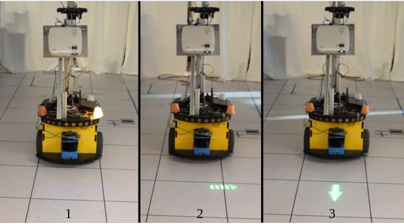
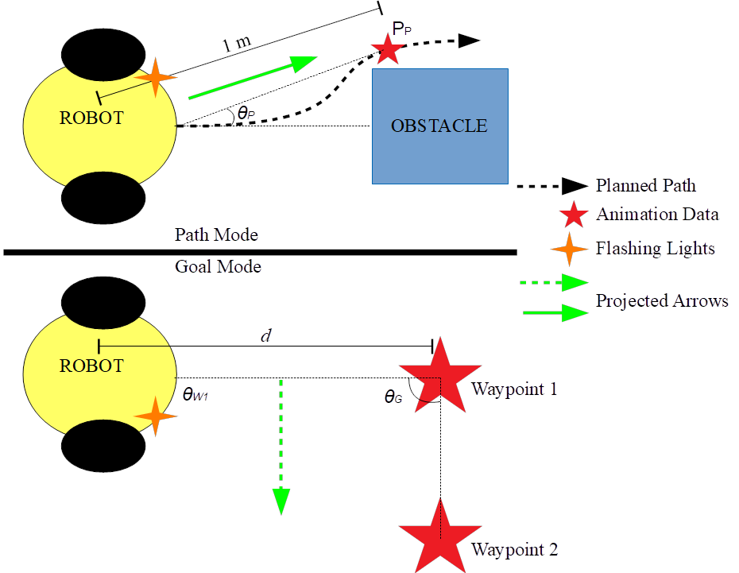
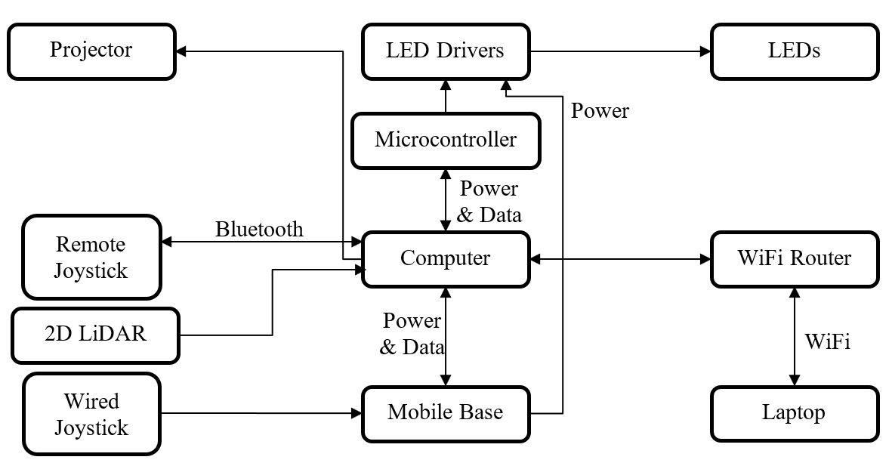
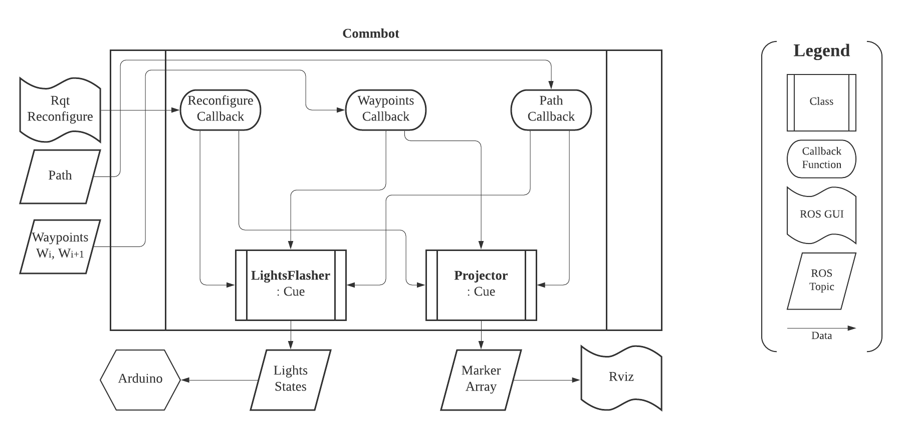
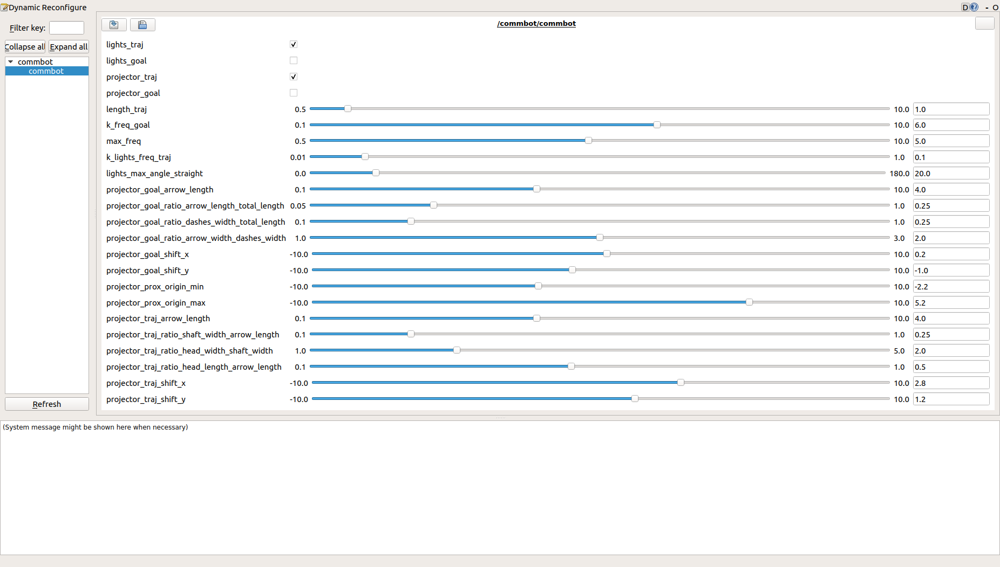
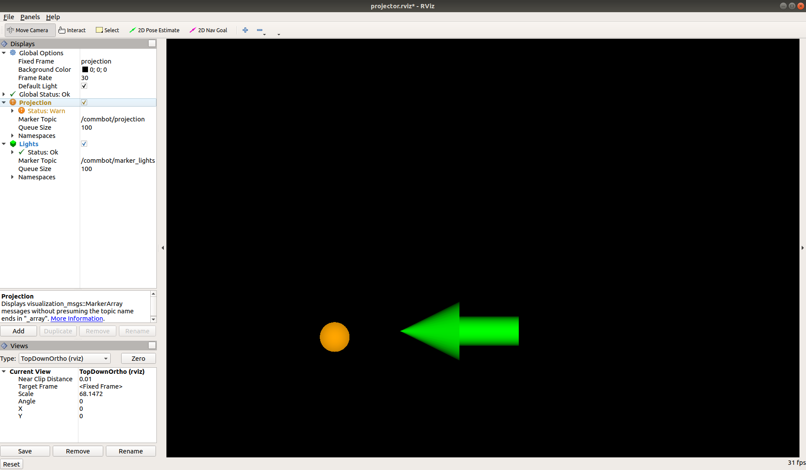
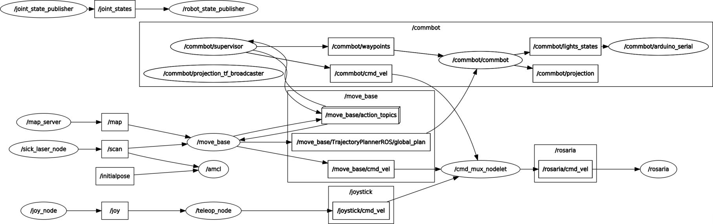
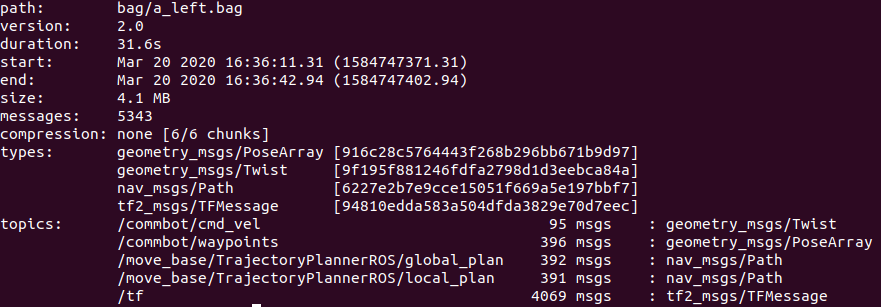
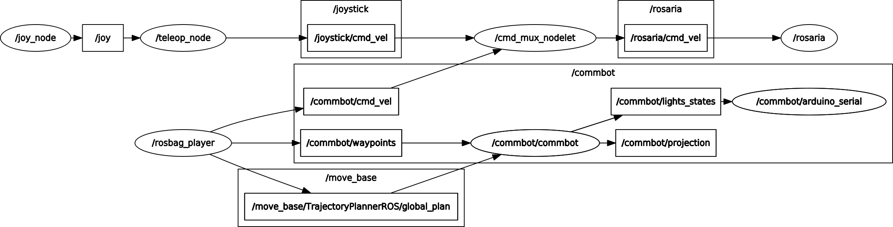

# Robot-to-Human Communication Cues
This is the [Robot Operating System (ROS) 1](https://www.ros.org/) package I developed during my MASc research: ["Design and Evaluation of Nonverbal Motion Cues for Human-Robot Spatial Interaction"](https://open.library.ubc.ca/cIRcle/collections/ubctheses/24/items/1.0394282).\
These *motion legibility cues* communicate a mobile robot's forthcoming motion to pedestrians.

\
*Images of the robot motion legibility cues:\
(1) FlashingLights indicating a left turn.\
(2) ProjectedArrows in Goal mode indicating a future left turn.\
(3) ProjectedArrows in Path mode indicating the next immediate movement will be straight.*

**Notes**:
* This package was only tested in the scenarios described in Chapter 3 of my [thesis](https://open.library.ubc.ca/cIRcle/collections/ubctheses/24/items/1.0394282), for the purpose of video demonstration for human-subjects experimentation.
* The videos used during the experiments are in a YouTube playlist [here](https://www.youtube.com/playlist?list=PLEdUFHpHT0jkm2OzE-49EHZxHk-XdVkF8). The videos are labelled by Cue Type, Cue Mode, and Robot Movement Scenario (see below).
* This package has been tested on Ubuntu 16 with ROS1 Kinetic and Ubuntu 18 with ROS1 Melodic.
* I assume the reader is familiar with [ROS1](https://www.ros.org/).
* Stay tuned for a publication in the 2021 IEEE International Conference on Robotics and Automation (ICRA) - hopefully.

**Contents**
* [Abstract](#abstract)
* [Functionality of Robot Communication Cues](#functionality-of-robot-communication-cues)
* [Implementation of Robot Communication Cues](#implementation-of-robot-communication-cues)
   * [Hardware Setup](#hardware-setup)
   * [Software Implementation](#software-implementation)
      * [Nodes](#nodes)
         * [1. commbot](#1-commbotcpp)
            * [1.1 Subscribed Topics](#11-subscribed-topics)
            * [1.2 Published Topics](#12-published-topics)
            * [1.3 Parameters](#13-parameters)
            * [1.4 Relevant Files](#14-relevant-files)
         * [2. supervisor](#2-supervisor)
            * [2.1 Published Topics](#21-published-topics)
            * [2.2 Parameters](#22-parameters)
         * [3. arduino_serial](#3-arduino_serial)
            * [3.1 Subscribed Topics](#31-subscribed-topics)
         * [4. lights_visualizer](#4-lights_visualizer)
            * [4.1 Subscribed Topics](#41-subscribed-topics)
            * [4.2 Published Topics](#42-published-topics)
      * [Launch Files](#launch-files)
         * [L1. commbot.launch](#l1-commbotlaunch)
         * [L2. supervisor.launch](#l2-supervisorlaunch)
         * [L3. rviz_projector.launch](#l3-rviz_projectorlaunch)
* [Instructions for Running this Package](#instructions-for-running-this-package)
* [Brief Description of Files](#brief-description-of-files)

## Abstract
Mobile robots have recently appeared in public spaces such as shopping malls, airports, and
urban sidewalks. These robots are designed with human-aware motion planning capabilities, but
they are not designed to communicate with pedestrians. Pedestrians encounter these robots
without any training or prior understanding of the robots’ behaviour, which can cause
discomfort, confusion, and delay social acceptance. The study for which I wrote this package evaluated robot communication cues designed for human-robot spatial interactions in public
spaces. By communicating robot behaviour to pedestrians, these cues aim to increase the social
acceptability of mobile robots. The study used videos of the robot cues and online surveys to
collect data from human participants.
The study evaluated two different modalities for communicating a robot’s movement to
pedestrians: FlashingLights and ProjectedArrows. Previous reviewed literature had not directly
compared these two modalities of motion legibility cues. The study also compared using these cues
to communicate path information or goal information, which are contributing factors to legible
robot motion. Previous reviewed literature had not compared path and goal information for
motion legibility cues using visual modalities. Results showed that ProjectedArrows is a more
socially acceptable modality than FlashingLights, and that these cues are most socially acceptable
when they communicate *both* path and goal information. The results of this work help guide the development of mobile robots for public spaces.

## Functionality of Robot Communication Cues
I prototyped two *Cue Types*: Projected Arrows and Flashing Lights. The
Projected Arrows use a light projector to animate a green
arrow on the ground in front of the robot. The Flashing
Lights use an orange LED on one side of the robot or the
other. Each Cue Type operates in one of three *Cue Modes*:
Path mode, Goal mode, or Path&Goal mode. These Cue Modes communcate information about the robot's path, its goal, or both, respectively. Note that the code uses "traj" (short for trajectory) to refer to the cues operating in path-predictability mode; this README and my thesis use "path" instead of "traj". The image above shows examples of different Cue Types operating in different Cue Modes.

The cues operate using data from
the robot's navigation system. In Path mode the robot
references a point Pp on its planned path 1 m ahead to
communicate its next immediate movement. In Goal mode,
the robot references its next two waypoints to communicate
its next destination. Distance d and angle *θ*w1 in the diagram below
are defined with respect to the robot’s next waypoint. In Goal mode the
cues only animate when d < 1.5 m and *θ*w1 < 45°. Path&Goal
mode is a sequential combination of both Path mode
and Goal mode: the cue operates in Goal mode if d < 1.5 m
and *θ*w1 < 45°, otherwise the cue operates in Path mode. I
designed Path mode for path-predictability and Goal mode
for goal-predictability.
When using Flashing Lights in Path mode, the angle *θ*p
from the robot to the point Pp determines which light to
flash. The robot treats paths with *θ*p < 20° as straight and
therefore flashes neither light. In Goal mode, the angle θG
between the next two waypoints in the robot’s frame
determines which light to flash. When using Projected
Arrows in Path mode, a solid arrow is drawn from the robot
to point Pp . In Goal mode, a flashing, dashed arrow is drawn
at angle *θ*G . The solid arrow was designed to communicate
immediately forthcoming motion; the flashing dashed arrow
was designed to communicate future motion. The arrows
were a fixed length of 30 cm.

In Path mode the Flashing Lights use a higher frequency
to represent a sharper angle of the next immediate
movement: the lights flash at a frequency of KG*θ*p , where KG
is 0.1 Hz/deg. In Goal mode both Cue Types use a higher
flashing frequency to represent a closer proximity to the next
waypoint: both flash at a frequency of KGd, where KG is 5
Hz/m and d is the distance in metres from the robot to its
next waypoint. All flashing frequencies were limited to 0.5-5
Hz to be visible.

\
*The robot’s motion legibility cues: Projected Arrows and Flashing
Lights. The robot uses its planned path to animate cues in Path mode, and
its next two waypoints to animate cues in Goal mode.*

## Implementation of Robot Communication Cues

### Hardware Setup
The mobile robot I used for this research comprised a [PowerBot](https://robots.ros.org/powerbot/) mobile base and several auxiliary components, which are shown in the schematic below.
\
*Schematic of the auxiliary components added to the mobile base.*

### Software Implementation
#### Nodes
##### 1. [commbot](nodes/commbot.cpp)
* Launched in commbot.launch
* Requires transform from `~frame_ids/world` param to `~frame_ids/robot` param.
The main `commbot` node uses data from the robot's navigation system to animate the FlashingLights and ProjectedArrows cues. The diagram below shows the anatomy of the `commbot` node.
\
*General diagram of the `commbot` node. The `commbot` node uses a Commbot object. The LightsFlasher and Projector classes are
members of the Commbot class. [LightsFlasher](include/LightsFlasher.hpp) and [Projector](include/Projector.hpp) inherit from the [Cue class](include/Cue.hpp). The LightsFlasher object controls the FlashingLights cue type and the
Projector object controls the ProjectedArrows cue type. The path input comes from the `move_base` node. The waypoints (Wi and Wi+1 ) are described below.*

###### 1.1 Subscribed Topics
* move_base/TrajectoryPlannerROS/global_plan ([nav_msgs/Path](http://docs.ros.org/en/melodic/api/nav_msgs/html/msg/Path.html))
   * The portion of the global plan that the local planner is currently attempting to follow.
   * Topic name set by `~topics/path` param in.
* ~waypoints ([geometry_msgs/PoseArray](http://docs.ros.org/en/melodic/api/geometry_msgs/html/msg/PoseArray.html))
   * Length 2: {Wi, Wi+1}. Wi is the waypoint to which the robot is currently navigating; Wi+1 is the next waypoint.
   * Topic name set by `~topics/waypoints` param.

###### 1.2 Published Topics
* ~lights_states ([commbot/LightStates](msg/LightStates.msg))
   * On/off states for left and right lights in the FlashingLights cue.
   * Topic name set by `~topics/lights` param.
* ~projection ([visualization_msgs/MarkerArray](http://docs.ros.org/en/melodic/api/visualization_msgs/html/msg/MarkerArray.html))
   * Animation for the ProjectedArrows cue. Designed for display in an [Rviz](http://wiki.ros.org/rviz) window by a light projector.
   * Topic name set by `~topics/projector` param.
   
###### 1.3 Parameters
* All set in the "commbot" namespace using [commbot.yaml](yaml/commbot.yaml) in [commbot.launch](launch/commbot.launch).
* ~frame_ids/...
   * world (`string`, default: "map")
      * Must match that used in nav. system.
   * robot (`string`, default: "base_link")
      * Must match that used in nav. system. 
   * projection (`string`, default: "projection")
      * Frame ID for projection image on ground in front of robot.
* ~topics/... : 
   * path (`string`, default: "/move_base/TrajectoryPlannerROS/global_plan")
      * Topic name for Path subscriber.
   * waypoints (`string`, default: "waypoints")
      * Topic name for PoseArray subscriber.
   * lights (`string`, default: "lights_states")
      * Topic name for LightStates publisher.
   * projector (`string`, default: "projection")
      * Topic name for MarkerArray publisher.
* ~min_prox_waypoint (`double`, default: 1.5)
   * Min. proximity to robot's current goal within which to activate Goal mode. See d in the diagram above.
   
* ~markers/...
   * goal/... scale and colour attributes for ProjectedArrows cue in Goal mode.
   * trajectory/... scale and colour attributes for ProjectedArrows cue in Path mode.
   
**Dynamically Reconfigurable Parameters**
* [commbot.launch](launch/commbot.launch) launches [`rqt_reconfigure`](http://wiki.ros.org/rqt_reconfigure) with [Commbot.cfg](cfg/Commbot.cfg) to set these params.
* Main categories are:
   * **Cue Type and Cue Mode activation**.
      * The cues will not animate unless these are set.
      * "traj" refers to Path mode.
      * Setting both Path and Goal mode will activate Path&Goal mode .
      * See above to explanations.
* See [Commbot.cfg](cfg/Commbot.cfg) for documentation.
* The image below shows the `rqt_reconfigure` window:

###### 1.4 Relevant Files
* [commbot.cpp](nodes/commbot.cpp)
   * Defines Commbot class, which has LightsFlasher and Projector members.
   * `cb_rcfg()` tunes and enables cues with `rqt_reconfigure`.
   * `cb_path()` uses `set_cue_traj()` in Cue.hpp to set data in LightsFlasher and Projector objects for Path mode.
   * `cb_waypoints()` uses `set_cue_goal()` in Cue.hpp to set set data in LightsFlasher and Projector objects for Goal mode.
* [Cue.hpp](include/Cue.hpp)
   * Parent of LightsFlasher and Projector
   * A timer periodically calls `publish_()`, which is overidden in children, to publish the cue data
   * Data are set with public setters. rqt_reconfigure "enables" the cues. "active" is used in Path&Goal mode to track which to publish
* [LightsFlasher.hpp](include/LightsFlasher.hpp), [Projector.hpp](Projector.hpp)
   * Children of Cue
   * Fields set by Commbot class
   * Define `publish_()`
* [Pulser.hpp](include/Pulser.hpp)
   * Timer++ with frequency settings used in LightsFlasher and Projector.
   
##### 2. [supervisor](nodes/supervisor.cpp)
* Launched in [supervisor.launch](supervisor.launch)
* Uses the [`move_base` Action API](http://wiki.ros.org/move_base#Action_API) to move the robot between waypoints {W0 , ..., Wn}  in the `~waypoints` param.
* At each waypoint, after sending Wi+1 to `move_base`, `supervisor` holds the robot still for a period specified in the `~pause` param. This pause allows pedestrians to observe the change in the cue before the robot starts moving to its next waypoint.
###### 2.1 Published Topics
* ~/waypoints ([geometry_msgs/PoseArray](http://docs.ros.org/en/melodic/api/geometry_msgs/html/msg/PoseArray.html))
   * {Wi, Wi+1} : Wi is the waypoint to which the robot is currently navigating; Wi+1 is the next waypoint. Vector is length 2.
   * Topic name set by `~topics/waypoints` param in.
* ~cmd_vel([geometry_msgs/Twist](http://docs.ros.org/en/api/geometry_msgs/html/msg/Twist.html))
   * A stream of velocity commands meant for execution by a mobile base.
###### 2.2 Parameters
* All set in the "commbot" namespace using [supervisor.yaml](supervisor.yaml) in [commbot.launch](launch/commbot.launch).
* ~pause (`double`, default: 5.0)
   * Time in seconds for which to halt the robot at each waypoint. See above.
* ~waypoints/...
  * Sent to `move_base` as described above.
  * Manually specified for the Robot Movement Scenarios described in my [thesis](https://open.library.ubc.ca/cIRcle/collections/ubctheses/24/items/1.0394282).
    * The "left" scenario moves the robot from start -> junction -> a -> a1.
    * The "right" scenario moves the robot from start -> junction -> c -> c1.

##### 3. [arduino_serial](arduino/lights_flasher.ino)
* Runs on an Arduino microcontroller to drive two LEDs for the FlashingLights cue.
* Launched in [commbot.launch](launch/commbot.launch) with `is_lights_arduino` arg.
###### 3.1 Subscribed Topics
* ~lights_states ([commbot/LightStates](msg/LightStates.msg))
   * On/off states for left and right lights in the FlashingLights cue.
   * Topic name set by `~topics/lights` param.

##### 4. [lights_visualizer](nodes/lights_visualizer.cpp)
* Publishes a Marker for visualizing the FlashingLights cue in [Rviz](http://wiki.ros.org/rviz).
* Launched in [commbot.launch](launch/commbot.launch) with `is_viz_lights` arg.
###### 4.1 Subscribed Topics
* ~lights_states ([commbot/LightStates](msg/LightStates.msg))
   * On/off states for left and right lights in the FlashingLights cue.
   * Topic name set by `~topics/lights` param.
###### 4.2 Published Topics
* ~marker_lights([visualization_msgs/Marker](http://docs.ros.org/en/melodic/api/visualization_msgs/html/msg/Marker.html))
   * Two orange spheres animated by the LightStates.
   
#### Launch Files
##### L1. [commbot.launch](launch/commbot.launch)
* Launches the `commbot` node.
* Launches a [tf/static_transform_publisher](http://wiki.ros.org/tf#static_transform_publisher) for a robot -> projection image tf.
* Launches `rqt_reconfigure` with [Commbot.cfg](cfg/Commbot.cfg) to set `commbot` node params.
* Optional args:
  * is_debug (`bool`, default: False)
    * Launch `commbot` node with [gdb](https://www.gnu.org/software/gdb/).
    * Note this package must be built with appropriate flags for this to work.
  * is_lights_arduino (`bool`, default: False)
    * Launch [`rosserial_python/serial_node`](http://wiki.ros.org/rosserial_python#serial_node.py) to connect with Arduino running [lights_flaher.ino](arduino/lights_flasher.ino).
  * is_bag (`bool`, default: False)
    * Plays a [rosbag](http://wiki.ros.org/rosbag) for repeatable behaviour instead of online navigation with `move_base` and `supervisor`.
    * Requires `bag` arg (`string`): filepath to rosbag.
    * Example rosbags are in the [bag](bag/) folder.
    * See below for more details.
  * is_viz_lights (`bool`, default: False)
    * Launches [`lights_visualizer`](nodes/lights_visualizer.cpp).

##### L2. [supervisor.launch](launch/supervisor.launch)
* Launches the `supervisor` node.
* Requred args:
  * goal_id (`string`)
    * ID of final waypoint.
    * Must match one of the waypoints in supervisor.yaml - either 'a' or 'c'.
* Optional args:
  * is_debug (`bool`, default: False)
      * Launch `supervisor` node with [gdb](https://www.gnu.org/software/gdb/).
      * Note this package must be built with appropriate flags for this to work.
      
##### L3. [rviz_projector.launch](launch/rviz_projector.launch)
* Launches Rviz with [projector.rviz](rviz/projector.rviz) to display the ProjectedArrows cue.
* This Rviz window is intended to be displayed through a light projector mounted on the robot.
* Also visualizes FlashingLights (requires `is_viz_lights` arg in commbot.launch).

## Instructions for Running this Package
* First, build and source this package in your ROS workspace.
* This package is designed to communicate the behaviour of a robot running the ROS Navigation Stack or equivalent nav. system, set up equivalently to the hardware schematic shown above.
* To run the `commbot` node: `roslaunch commbot commbot.launch`.
  * `commbot` can be run alone, if another system replaces `supervisor`.
  * `commbot` can also be run with the ROS Nav. Stack *without* the `supervisor` node, but only the Path mode will work, not the Goal mode.
  * Activate the cues using the `rqt_reconfigure` GUI.
* To run the `supervisor` node: `roslaunch commbot supervisor.launch goal_id:='a'` or `goal_id:='c'`.
  * Requirements for `supervisor` to work:
    * The mobile base must execute geometry_msgs/Twist msgs on `/commbot/cmd_vel`. I used a [software multiplexer](http://wiki.ros.org/yocs_cmd_vel_mux) to prioritze /commbot/cmd_vel over /move_base/cmd_vel (both lower priority than a joystick).
    * The robot must be running `move_base` from the ROS Nav. Stack.
 * To run Rviz for the ProjetedArrows cue: `roslaunch commbot rviz_projector.launch`
  * This Rviz window is intended to be displayed through a light projector mounted on the robot.
  * One can also run this in a desktop environment for testing.
  * Below is the expected Rviz window when both FlashingLights and ProjectedArrows are in Path mode ("traj") and the `is_viz_lights` arg is set in commbot.launch:
  
  *Rviz window for displaying the ProjectedArrows cue. The orange spheres are visualizations of the FlashingLights cue.*
 * Expected rosgraph:
 
 *Graph of the ROS network when the motion legibility cues are used with the ROS Navigation Stack and `supervisor`. The `arduino_serial` node runs on an Arduino microcontroller to control the FlashingLights cue. All other nodes run on the onboard computer. Rviz is used through a light projector to show `/commbot/projection` on the ground in front of the robot.*
 
 **rosbags for Repeatable Movement**
 * `commbot` can also be run with a [rosbag](http://wiki.ros.org/rosbag) for repeatable movement instead of online navigation with `move_base` and `supervisor`.
  * ``roslaunch commbot commbot.launch is_bag:='true' bag:=`rospack find commbot`/bag/a_left.bag`` or other rosbags in the [bag](bag) folder.
  * rosbags are named a/c_left/right.bag. A and C are left and straight movement scenarios; "left" or "right" is the direction of movement around an obstacle in the scenarios described in Chapter 3 of my [thesis](https://open.library.ubc.ca/cIRcle/collections/ubctheses/24/items/1.0394282).
  * Below are the required contents of the bags:\
  
  * Required transforms in `/tf`:
    * `~frame_ids/world` (default: "world") -> `~frame_ids/robot` (default: "base_link")
    * `~frame_ids/robot` -> `~frame_ids/projection` (default: "projection")
  * I recorded each bag when moving the robot with the `supervisor` node. I then used [this script](scripts/cmd_vel_rosaria_to_commbot.py) to convert `/rosaria/cmd_vel` msgs to `/commbot/cmd_vel` msgs, so I could still override with the joystick when using a rosbag.
  * Expected rosgraph:
 
 *Graph of the ROS network when the motion legibility cues are used with a rosbag.*

That's all, folks! Please feel free to contact me with any questions, concerns, or feedback: [nicholas.j.hetherington@gmail.com](mailto:nicholas.j.hetherington@gmail.com) :)

Please read and abide by the [license](LICENSE.md).
